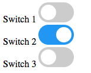

# simple-hash-router
A generic hash based URL router for manipulating between URL and DOM state.

This is a little playground for testing the basics of hash-based URL routing to update the URL hash based on DOM events, and then update the DOM state based on changes to the URL hash.

Toggling the switches on and off will set a simple binary state in the URL `#switches=000` is all switches off.  The hash `#switches=010` would have only the middle switch on.

`...index.html#switches=010`

Inspiration:

http://krasimirtsonev.com/blog/article/deep-dive-into-client-side-routing-navigo-pushstate-hash
http://krasimirtsonev.com/blog/article/A-modern-JavaScript-router-in-100-lines-history-api-pushState-hash-url

Toggle Switch design:

https://www.w3schools.com/howto/howto_css_switch.asp
